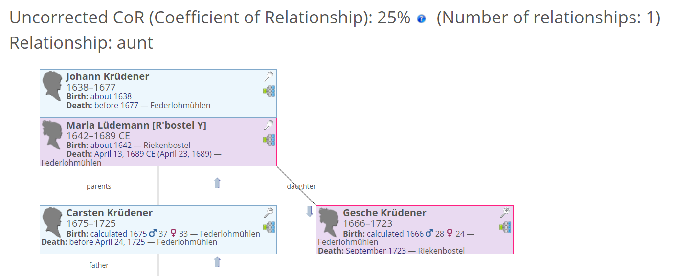
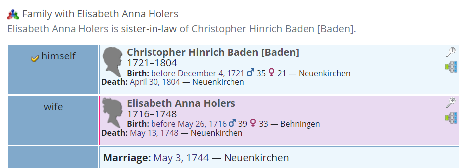
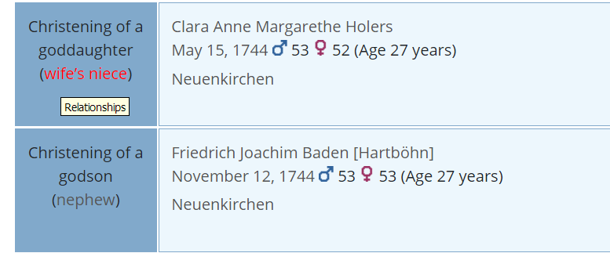

# ⚶ Vesta Extended Relationships (Webtrees 2 Custom Module)

This [webtrees](https://www.webtrees.net/) custom module provides an extended 'Relationships' chart. It also displays additional relationship information via the extended 'Families' tab, and the extended 'Facts and Events' tab.
The project’s website is [cissee.de](https://cissee.de).

This is a webtrees 2.x module - It cannot be used with webtrees 1.x. For its webtrees 1.x counterpart, see [here](https://github.com/ric2016/extended_relationships).

## Contents

* [Features](#features)
* [Download](#download)
* [Installation](#installation)
* [License](#license)

### Features<a name="features"/>

* The extended relationship chart provides additional options for calculating reationships. Common ancestors are included in the relationship path.

* The module provides proper language-specific relationship names, currently for English, German, Slovak, and Dutch. Additional languages may be added on request, but note that this feature will finally be supported in the webtrees core code as well in the near future.
* In the extended 'Families' tab, the relationship to the default individual is displayed, as well as prior relationships between married individuals. The latter are calculated relative to the date of the marriage (to avoid the trivial relationship husband/wife), which allows us to show e.g. that someone married his brother's wife's sister.

* On the extended 'Facts and Events' tab, relationships to associated individuals are calculated similarly (relative to the date of the event).	
* Most features are configurable via module administration.
* On the extended 'Facts and Events' tab, inverse associations and relationships are also displayed:

### Download<a name="download"/>

* Current version: 2.1.16.0.0
* Based on and tested with webtrees 2.1.16. Requires webtrees 2.1.15 or later.
* Requires the ⚶ Vesta Common module ('vesta_common').
* Displays data via the ⚶ Vesta Families module ('vesta_relatives'). 
* Displays data via the ⚶ Vesta Facts and events module ('vesta_personal_facts'). 
* Download the zip file, which includes all Vesta modules, [here](https://cissee.de/vesta.latest.zip).
* Support, suggestions, feature requests: <ric@richard-cissee.de>. See also [this webtrees forum thread](https://www.webtrees.net/index.php/en/forum/4-customising/31587-extended-relationships-module-feature-requests).
* Issues also via <https://github.com/vesta-webtrees-2-custom-modules/vesta_extended_relationships/issues>
* Translations may be contributed via weblate: <https://hosted.weblate.org/projects/vesta-webtrees-custom-modules/>

### Installation<a name="installation"/>

* Unzip the files and copy the contents of the modules_v4 folder to the respective folder of your webtrees installation. All related modules are included in the zip file. It's safe to overwrite the respective directories if they already exist (they are bundled with other custom modules as well), as long as other custom models using these dependencies are also upgraded to their respective latest versions.
* Enable the extended 'Families' module via Control Panel -> Modules -> All modules -> ⚶ Vesta Families.
* Enable the extended 'Facts and Events' module via Control Panel -> Modules -> All modules -> ⚶ Vesta Facts and Events.
* Enable the main module via Control Panel -> Modules -> All modules -> ⚶ Vesta Extended Relationships. After that, you may configure several options.
* Configure the visibility of the old and the extended 'Families' tab via Control Panel -> Modules -> Tabs (usually, you'll want to use only one of them. You may just disable the original 'Families' module altogether).		
* Configure the visibility of the old and the extended 'Facts and Events' tab via Control Panel -> Modules -> Tabs (usually, you'll want to use only one of them. You may just disable the original 'Facts and Events' module altogether).

### License<a name="license"/>

* **vesta_extended_relationships: a webtrees custom module**
* Copyright (C) 2019 – 2023 Richard Cissée
* Derived from **webtrees** - Copyright 2022 webtrees development team.
* French translations provided by Michel Rivière.
* Dutch translations provided by Frans Weber and TheDutchJewel.
* Slovak translations provided by Ladislav Rosival.
* Czech translations provided by Josef Prause.
* Further translations contributed via weblate.

This program is free software: you can redistribute it and/or modify
it under the terms of the GNU General Public License as published by
the Free Software Foundation, either version 3 of the License, or
(at your option) any later version.

This program is distributed in the hope that it will be useful,
but WITHOUT ANY WARRANTY; without even the implied warranty of
MERCHANTABILITY or FITNESS FOR A PARTICULAR PURPOSE. See the
GNU General Public License for more details.

You should have received a copy of the GNU General Public License
along with this program. If not, see <http://www.gnu.org/licenses/>.
